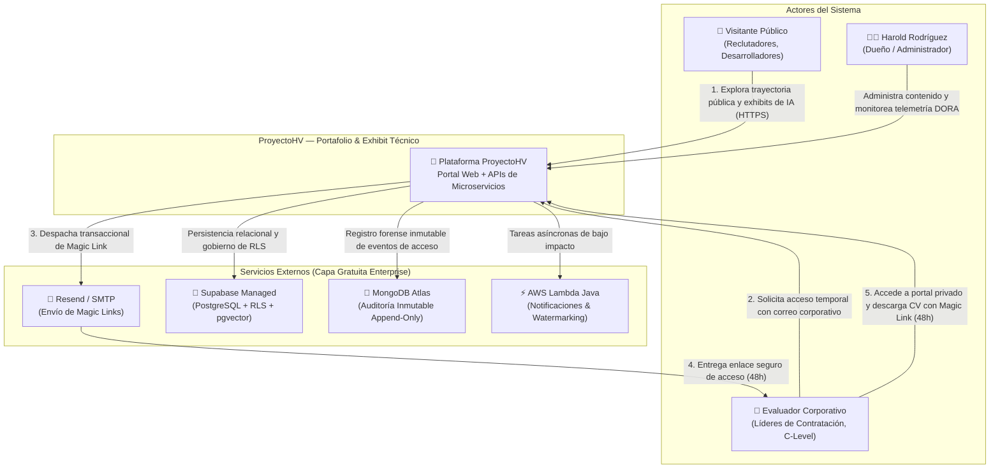
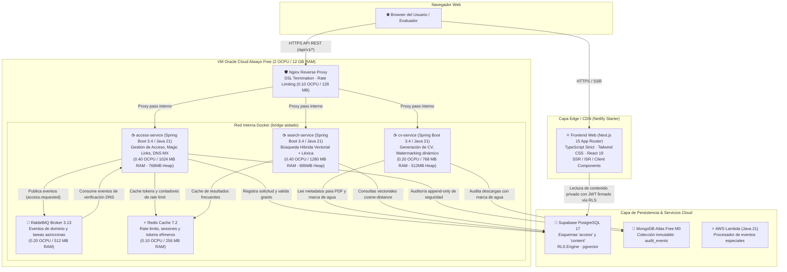
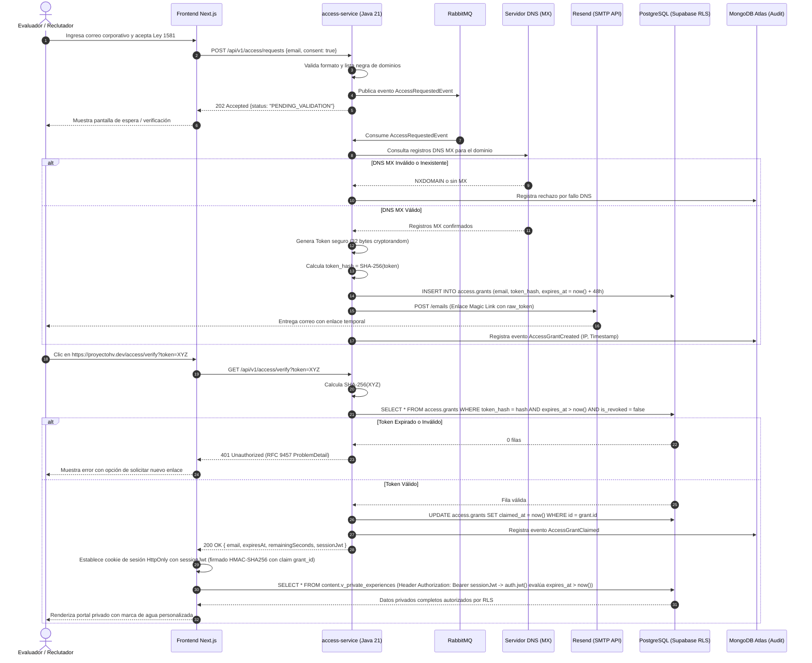

# Arquitectura C4 y Patrones de Diseño — ProyectoHV

> **Fase:** 2 · Diseño  
> **Estado:** Aprobado para diseño técnico  
>
> **Decisión humana**
> - **Qué decidió Harold:** Desacoplar el sistema en una topología híbrida con frontend Next.js en edge, microservicios Java 21 Spring Boot en contenedores ARM sobre VM Oracle, serverless en AWS Lambda y base de datos relacional/vectorial en Supabase; adoptar Arquitectura Hexagonal en el backend para aislar completamente el dominio de negocio.
> - **Qué ejecutó la IA:** Diagramación formal bajo el modelo C4 (Contexto, Contenedores, Componentes y Código), especificación de puertos e interfaces hexagonales, asignación estricta de cuotas de recursos y definición de flujos de interacción asíncrona.
> - **Riesgo técnico asumido conscientemente:** La comunicación asíncrona vía RabbitMQ introduce eventual consistencia en el estado de validación DNS de solicitudes de acceso, mitigada mediante polling de estado en frontend o actualización reactiva con SSE.
> - **Alternativas descartadas:** Monolito MVC tradicional en Spring Boot con renderizado de servidor Thymeleaf (no demuestra stack moderno de frontend React/Next.js); arquitectura 100% serverless en AWS (costo potencial fuera de capa gratuita y menor cobertura de tecnologías backend enterprise del perfil maestro).

---

## 1. Nivel 1: Diagrama de Contexto del Sistema (System Context)

El diagrama de contexto ilustra cómo ProyectoHV interactúa con los distintos actores humanos y los sistemas externos de soporte.



---

## 2. Nivel 2: Diagrama de Contenedores (Container Diagram)

El sistema se distribuye en tres zonas de ejecución coordinadas para no incurrir en costos (objetivo <= $0/mes en operación regular o < USD 3/mes total) respetando las cuotas de la VM Oracle Cloud (2 OCPU / 12 GB ARM):



### Conciliación de Recursos en la VM Oracle (ARM)

| Contenedor / Proceso | CPU Quota (Ceiling) | Límite RAM Docker | Heap JVM (`MaxRAMPercentage`) |
|---|---|---|---|
| **Nginx Reverse Proxy** | 0.10 OCPU | 128 MB (0.125 GB) | N/A (C nativo) |
| **access-service** | 0.40 OCPU | 1024 MB (1.00 GB) | 768 MB (75.0%) |
| **cv-service** | 0.20 OCPU | 768 MB (0.75 GB) | 512 MB (66.6%) |
| **search-service** | 0.40 OCPU | 1280 MB (1.25 GB) | 896 MB (70.0%) |
| **RabbitMQ Broker** | 0.20 OCPU | 512 MB (0.50 GB) | Erlang VM (~256 MB) |
| **Redis Cache** | 0.10 OCPU | 256 MB (0.25 GB) | N/A (en memoria ~128 MB) |
| **Total Contenedores** | **1.40 OCPU** | **3968 MB (~3.88 GB)** | **2176 MB (~2.13 GB)** |
| **Host Linux + Docker Daemon** | 0.60 OCPU libre (**30%**) | ~2048 MB (~2.00 GB) | N/A |
| **Capacidad Total VM** | **2.00 OCPU (100%)** | **12288 MB (12.00 GB)** | **6272 MB (~6.12 GB libre, ~51%)** |

---

## 3. Nivel 3: Diagrama de Componentes de `access-service` (Hexagonal Architecture)

El microservicio `access-service` implementa **Arquitectura Hexagonal (Ports & Adapters)** estricta, desacoplando la lógica de negocio de la infraestructura técnica.

```mermaid
classDiagram
    namespace Inbound_Adapters {
        class AccessRestController {
            +requestAccess(RequestDto) ResponseEntity
            +verifyAccess(token) ResponseEntity
            +getStatus(token) ResponseEntity
            +extendAccess(token) ResponseEntity
        }
        class AccessEventsListener {
            +onAccessRequested(AccessRequestedEvent)
        }
    }

    namespace Inbound_Ports {
        class RequestAccessUseCase {
            <<interface>>
            +execute(RequestCommand) AccessRequestResult
        }
        class VerifyAccessUseCase {
            <<interface>>
            +execute(VerifyCommand) AccessGrantResult
        }
        class CheckStatusUseCase {
            <<interface>>
            +execute(String token) StatusResult
        }
    }

    namespace Domain_Core {
        class AccessRequest {
            -Email corporateEmail
            -ValidationStatus status
            -Instant requestedAt
            +markDnsValid()
            +markDnsInvalid(String reason)
        }
        class AccessGrant {
            -GrantId id
            -Email corporateEmail
            -TokenHash tokenHash
            -Instant expiresAt
            -boolean isRevoked
            +boolean isExpired()
            +extend48Hours()
        }
        class CorporateEmailPolicy {
            +boolean isBlockedDomain(String domain)
        }
    }

    namespace Outbound_Ports {
        class AccessGrantRepositoryPort {
            <<interface>>
            +save(AccessGrant grant)
            +findByTokenHash(TokenHash hash) Optional
        }
        class DnsMxResolverPort {
            <<interface>>
            +hasValidMxRecords(String domain) boolean
        }
        class NotificationPort {
            <<interface>>
            +sendMagicLink(Email email, String rawToken)
        }
        class AuditEventPort {
            <<interface>>
            +recordSecurityEvent(SecurityAuditEvent event)
        }
    }

    namespace Outbound_Adapters {
        class PostgresAccessGrantAdapter {
            -JdbcClient jdbcClient
            +save()
            +findByTokenHash()
        }
        class DnsJavaResolverAdapter {
            -Lookup dnsLookup
            +hasValidMxRecords()
        }
        class ResendNotificationAdapter {
            -RestClient restClient
            +sendMagicLink()
        }
        class MongoAuditAdapter {
            -MongoTemplate mongoTemplate
            +recordSecurityEvent()
        }
    }

    AccessRestController --> RequestAccessUseCase
    AccessRestController --> VerifyAccessUseCase
    AccessEventsListener --> VerifyAccessUseCase

    RequestAccessUseCase ..|> AccessRequest
    VerifyAccessUseCase ..|> AccessGrant

    RequestAccessUseCase --> AccessGrantRepositoryPort
    RequestAccessUseCase --> DnsMxResolverPort
    RequestAccessUseCase --> NotificationPort
    RequestAccessUseCase --> AuditEventPort

    PostgresAccessGrantAdapter ..|> AccessGrantRepositoryPort
    DnsJavaResolverAdapter ..|> DnsMxResolverPort
    ResendNotificationAdapter ..|> NotificationPort
    MongoAuditAdapter ..|> AuditEventPort
```



---

## 4. Nivel 4: Estándares de Código y Directrices de Implementación

Para asegurar que el código construido en la Fase 3 sea consistente y fácil de auditar, se establecen las siguientes reglas estructurales:

### 4.1. Reglas de Aislamiento de Capas (Clean Architecture)
1. **Paquete `domain` puro:**
   - Prohibido importar cualquier clase de `org.springframework.*`, `jakarta.persistence.*`, `com.mongodb.*` o `io.lettuce.*`.
   - Únicamente Java estándar (`java.time.*`, `java.util.*`, `java.lang.*`).
   - Los Value Objects (ej. `Email`, `TokenHash`) son inmutables mediante `record` de Java 21.
2. **Paquete `application` (Casos de Uso):**
   - Orquesta la lógica del dominio e interactúa únicamente con interfaces de puertos de salida (`ports.out`).
   - Transaccionalidad demarcada en este nivel si aplica (`@Transactional(readOnly = true)` por defecto).
3. **Paquete `infrastructure` (Adaptadores):**
   - Aloja controladores Spring MVC, repositorios Spring Data / JDBC, clientes HTTP y consumidores RabbitMQ.
   - Traduce DTOs externos a modelos de dominio antes de llamar a los casos de uso.

### 4.2. Métricas de Líneas y Complejidad
- **Métodos:** Óptimo entre 5 y 20 líneas de lógica de negocio. Máximo 30 líneas. Si excede 40 líneas debe refactorizarse en métodos privados o nuevos casos de uso.
- **Clases:** Máximo 200 a 300 líneas. Si una clase crece más allá de 300 líneas, es síntoma directo de violación del Principio de Responsabilidad Única (SRP).

### 4.3. Manejo Centralizado de Excepciones y Respuestas RFC 9457
Todo microservicio Java implementa `@RestControllerAdvice` centralizado para mapear excepciones a `ProblemDetail` (RFC 9457):

```java
@RestControllerAdvice
public class GlobalExceptionHandler extends ResponseEntityExceptionHandler {

    @ExceptionHandler(AccessGrantNotFoundException.class)
    public ProblemDetail handleNotFound(AccessGrantNotFoundException ex) {
        ProblemDetail problem = ProblemDetail.forStatusAndDetail(HttpStatus.NOT_FOUND, ex.getMessage());
        problem.setTitle("Grant de acceso no encontrado o expirado");
        problem.setType(URI.create("https://proyectohv.dev/errors/access-grant-not-found"));
        problem.setProperty("timestamp", Instant.now());
        return problem;
    }

    @ExceptionHandler(DomainMxValidationException.class)
    public ProblemDetail handleInvalidDomain(DomainMxValidationException ex) {
        ProblemDetail problem = ProblemDetail.forStatusAndDetail(HttpStatus.UNPROCESSABLE_ENTITY, ex.getMessage());
        problem.setTitle("Dominio de correo inválido o sin registros MX");
        problem.setType(URI.create("https://proyectohv.dev/errors/invalid-email-domain"));
        problem.setProperty("domain", ex.getDomain());
        return problem;
    }
}
```

---

## 5. Diagrama de Secuencia del Flujo de Acceso 48h


