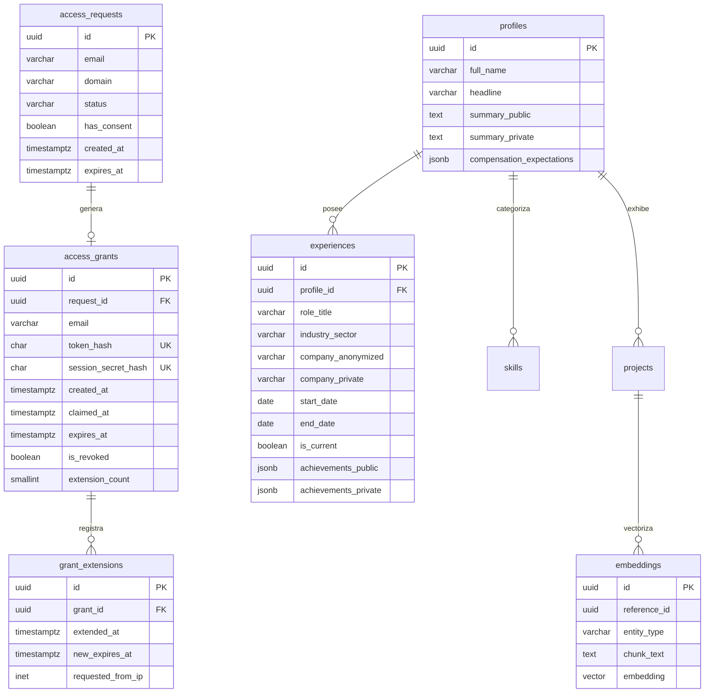

# Modelo de Datos, Esquemas y Políticas RLS — ProyectoHV

> **Fase:** 2 · Diseño  
> **Estado:** Aprobado para diseño técnico  
>
> **Decisión humana**
> - **Qué decidió Harold:** Desacoplar la persistencia en tres motores complementarios especializados: PostgreSQL en Supabase como fuente relacional y vectorial con gobierno de seguridad por RLS; MongoDB Atlas como repositorio append-only de auditoría forense inmutable; y Redis como almacén en memoria para mitigación de DoS y control de cuotas; delegar el TTL de 48 horas exclusivamente a políticas de base de datos en Postgres.
> - **Qué ejecutó la IA:** Especificación DDL completa de los esquemas `access` y `content`, definición de políticas RLS, configuración de índices vectoriales con pgvector (HNSW), esquemas de documentos MongoDB con retención de 90 días y convenciones de claves Redis.
> - **Riesgo técnico asumido conscientemente:** La expiración por RLS basada en `now()` evalúa la hora del servidor de PostgreSQL, lo cual requiere sincronización estricta de relojes NTP entre el host de la VM Oracle, la base de datos Supabase y el cliente.
> - **Alternativas descartadas:** Guardar eventos de auditoría en la misma base de datos relacional (expone la auditoría a manipulación en caso de inyección SQL o escalada en Postgres); implementar el TTL de 48 h en tokens de sesión JWT en el cliente (viola el principio de seguridad en profundidad y es vulnerable a manipulaciones).

---

## 1. Persistencia Relacional y Vectorial: PostgreSQL (Supabase)

La base de datos PostgreSQL se divide en dos esquemas aislados por responsabilidad y nivel de privilegio: `access` (identidad y grants temporales) y `content` (información del portafolio y embeddings semánticos).



---

## 2. Esquema DDL de Acceso y Políticas RLS

### 2.1. Creación del Esquema `access`

```sql
-- Habilitar extensiones requeridas
CREATE EXTENSION IF NOT EXISTS "uuid-ossp";
CREATE EXTENSION IF NOT EXISTS "pgcrypto";
CREATE EXTENSION IF NOT EXISTS "vector";

CREATE SCHEMA IF NOT EXISTS access;

-- 1. Tabla de Solicitudes de Acceso
CREATE TABLE access.requests (
    id UUID PRIMARY KEY DEFAULT gen_random_uuid(),
    email VARCHAR(255) NOT NULL,
    domain VARCHAR(255) NOT NULL,
    status VARCHAR(32) NOT NULL DEFAULT 'PENDING' 
        CHECK (status IN ('PENDING', 'MX_VALID', 'MX_INVALID', 'ISSUED', 'EXPIRED', 'REJECTED')),
    failure_reason TEXT,
    ip_address INET NOT NULL,
    user_agent TEXT,
    has_consent BOOLEAN NOT NULL DEFAULT FALSE,
    created_at TIMESTAMPTZ NOT NULL DEFAULT now(),
    expires_at TIMESTAMPTZ NOT NULL DEFAULT (now() + interval '24 hours')
);

CREATE INDEX idx_requests_email_created ON access.requests(email, created_at DESC);
CREATE INDEX idx_requests_status_expires ON access.requests(status, expires_at);

-- 2. Tabla de Concesiones de Acceso (Grants) con TTL de 48h
CREATE TABLE access.grants (
    id UUID PRIMARY KEY DEFAULT gen_random_uuid(),
    request_id UUID NOT NULL REFERENCES access.requests(id) ON DELETE CASCADE,
    email VARCHAR(255) NOT NULL,
    token_hash CHAR(64) NOT NULL UNIQUE,          -- SHA-256 del Magic Link Token
    created_at TIMESTAMPTZ NOT NULL DEFAULT now(),
    claimed_at TIMESTAMPTZ,
    expires_at TIMESTAMPTZ NOT NULL DEFAULT (now() + interval '48 hours'),
    is_revoked BOOLEAN NOT NULL DEFAULT FALSE,
    extension_count SMALLINT NOT NULL DEFAULT 0 CHECK (extension_count <= 2), -- Alinear con RF-09 (hasta 2 auto)
    last_extended_at TIMESTAMPTZ,
    CONSTRAINT chk_grant_expiration CHECK (expires_at > created_at)
);

CREATE INDEX idx_grants_token_hash ON access.grants(token_hash);
CREATE INDEX idx_grants_expiration ON access.grants(expires_at) WHERE is_revoked = FALSE;

-- 3. Tabla de Extensiones de Acceso (Alineada con RF-09: 2 extensiones auto-servicio; 3ra requiere aprobación manual)
CREATE TABLE access.grant_extensions (
    id UUID PRIMARY KEY DEFAULT gen_random_uuid(),
    grant_id UUID NOT NULL REFERENCES access.grants(id) ON DELETE CASCADE,
    extension_number SMALLINT NOT NULL CHECK (extension_number BETWEEN 1 AND 3),
    status VARCHAR(32) NOT NULL DEFAULT 'APPROVED' 
        CHECK (status IN ('APPROVED', 'PENDING_MANUAL_APPROVAL', 'REJECTED')),
    extended_at TIMESTAMPTZ NOT NULL DEFAULT now(),
    new_expires_at TIMESTAMPTZ NOT NULL,
    requested_from_ip INET NOT NULL,
    reason TEXT,
    approved_by_admin BOOLEAN DEFAULT FALSE,
    approval_notes TEXT
);
```

### 2.2. Esquema `content` y Vistas Particionadas

```sql
CREATE SCHEMA IF NOT EXISTS content;

-- Tabla Base de Experiencias Profesionales (Columnas estrictamente públicas)
CREATE TABLE content.experiences (
    id UUID PRIMARY KEY DEFAULT gen_random_uuid(),
    role_title VARCHAR(128) NOT NULL,
    industry_sector VARCHAR(64) NOT NULL,         -- 'Fintech', 'Retail', 'Telecomunicaciones'
    company_public_label VARCHAR(64) NOT NULL,    -- 'Importante empresa del sector financiero'
    start_date DATE NOT NULL,
    end_date DATE,
    is_current BOOLEAN NOT NULL DEFAULT FALSE,
    summary_public TEXT NOT NULL,
    technologies TEXT[] NOT NULL DEFAULT '{}',
    created_at TIMESTAMPTZ NOT NULL DEFAULT now()
);

-- Tabla de Detalles Privados de Experiencia (1:1 con experiences, protegida por RLS - H-2)
CREATE TABLE content.experience_private_details (
    id UUID PRIMARY KEY DEFAULT gen_random_uuid(),
    experience_id UUID NOT NULL UNIQUE REFERENCES content.experiences(id) ON DELETE CASCADE,
    company_private_name VARCHAR(128) NOT NULL,    -- Nombre empresarial (Regla #0: sin clientes de empleadores)
    details_private TEXT NOT NULL,                 -- Detalle de arquitectura, impacto y decisiones
    architectural_decisions TEXT[] NOT NULL DEFAULT '{}',
    team_metrics JSONB NOT NULL DEFAULT '{}',
    updated_at TIMESTAMPTZ NOT NULL DEFAULT now()
);

-- Tabla de Expectativas Salariales y Disponibilidad (Privado Estricto)
CREATE TABLE content.compensation_details (
    id UUID PRIMARY KEY DEFAULT gen_random_uuid(),
    target_role VARCHAR(64) NOT NULL,
    modality VARCHAR(32) NOT NULL DEFAULT 'Hibrido / Remoto',
    availability_notice_days SMALLINT NOT NULL DEFAULT 30,
    salary_currency CHAR(3) NOT NULL DEFAULT 'COP',
    salary_expectation_min NUMERIC(12, 2) NOT NULL,
    salary_expectation_target NUMERIC(12, 2) NOT NULL,
    relocation_available BOOLEAN NOT NULL DEFAULT FALSE,
    updated_at TIMESTAMPTZ NOT NULL DEFAULT now()
);

-- Tabla Vectorial para Búsqueda Semántica con pgvector
CREATE TABLE content.knowledge_vectors (
    id UUID PRIMARY KEY DEFAULT gen_random_uuid(),
    entity_type VARCHAR(32) NOT NULL,             -- 'experience', 'adr', 'skill', 'exhibit'
    reference_id UUID,
    title VARCHAR(255) NOT NULL,
    content_chunk TEXT NOT NULL,
    metadata JSONB NOT NULL DEFAULT '{}',
    is_private BOOLEAN NOT NULL DEFAULT FALSE,
    embedding VECTOR(1536) NOT NULL,              -- OpenAI text-embedding-3-small (o Gemini embeddings)
    created_at TIMESTAMPTZ NOT NULL DEFAULT now()
);

-- Índice HNSW para similitud coseno ultra rápida
CREATE INDEX idx_knowledge_vectors_hnsw 
ON content.knowledge_vectors 
USING hnsw (embedding vector_cosine_ops)
WITH (m = 16, ef_construction = 64);
```

---

## 3. Políticas de Seguridad RLS (Row Level Security)

PostgreSQL es el árbitro final de autorización. Todas las tablas tienen RLS habilitado sin excepción.

```sql
-- 1. Habilitar RLS en todas las tablas
ALTER TABLE access.requests ENABLE ROW LEVEL SECURITY;
ALTER TABLE access.grants ENABLE ROW LEVEL SECURITY;
ALTER TABLE access.grant_extensions ENABLE ROW LEVEL SECURITY;
ALTER TABLE content.experiences ENABLE ROW LEVEL SECURITY;
ALTER TABLE content.experience_private_details ENABLE ROW LEVEL SECURITY;
ALTER TABLE content.compensation_details ENABLE ROW LEVEL SECURITY;
ALTER TABLE content.knowledge_vectors ENABLE ROW LEVEL SECURITY;

-- 2. Función de Seguridad para Comprobar Vigencia de Grant
CREATE OR REPLACE FUNCTION access.is_active_grant(grant_uuid UUID)
RETURNS BOOLEAN AS $$
BEGIN
    IF grant_uuid IS NULL THEN
        RETURN FALSE;
    END IF;

    RETURN EXISTS (
        SELECT 1 
        FROM access.grants g
        WHERE g.id = grant_uuid
          AND g.is_revoked = FALSE
          AND g.expires_at > now()
    );
END;
$$ LANGUAGE plpgsql SECURITY DEFINER STABLE;

-- 3. Función Criptográfica para Extraer Grant ID del JWT Firmado (H-1 Resuelto)
-- NUNCA se lee de headers HTTP arbitrarios.
-- El grant_id reside en el claim firmado del token JWT emitido por Supabase Auth (auth.jwt()).
CREATE OR REPLACE FUNCTION access.current_session_grant()
RETURNS UUID AS $$
    SELECT NULLIF(auth.jwt() ->> 'grant_id', '')::uuid;
$$ LANGUAGE sql STABLE;

-- 4. Políticas para content.experiences (Base Pública: columnas exclusivamente públicas)
CREATE POLICY p_experiences_public_read ON content.experiences
    FOR SELECT TO anon, authenticated
    USING (true);

-- 5. Políticas para content.experience_private_details (Solo con Grant Válido en JWT - H-2 Resuelto)
CREATE POLICY p_experience_details_grant_read ON content.experience_private_details
    FOR SELECT TO authenticated
    USING (access.is_active_grant(access.current_session_grant()));

-- 6. Políticas para content.compensation_details (Solo con Grant Válido en JWT)
CREATE POLICY p_compensation_grant_read ON content.compensation_details
    FOR SELECT TO authenticated
    USING (access.is_active_grant(access.current_session_grant()));

-- 7. Políticas para content.knowledge_vectors (Búsqueda Semántica)
CREATE POLICY p_vectors_search ON content.knowledge_vectors
    FOR SELECT TO anon, authenticated
    USING (
        is_private = FALSE 
        OR (is_private = TRUE AND access.is_active_grant(access.current_session_grant()))
    );

-- 8. Vista Pública Proyectada (Security Invoker)
CREATE OR REPLACE VIEW content.v_public_experiences WITH (security_invoker = true) AS
SELECT 
    id, role_title, industry_sector, company_public_label,
    start_date, end_date, is_current, summary_public, technologies
FROM content.experiences;

-- 9. Vista Privada Integrada (Une base pública con detalles privados gobernados por RLS)
CREATE OR REPLACE VIEW content.v_private_experiences WITH (security_invoker = true) AS
SELECT 
    e.id, e.role_title, e.industry_sector, e.company_public_label,
    p.company_private_name, e.start_date, e.end_date, e.is_current,
    e.summary_public, p.details_private, p.architectural_decisions,
    p.team_metrics, e.technologies
FROM content.experiences e
JOIN content.experience_private_details p ON e.id = p.experience_id;
```

### 3.1. Prueba de Bypass de Seguridad (Verificación Anti-Tampering y Anti-Elevation)

Para certificar que la seguridad reside en la base de datos y que PostgREST/Supabase rechazan cabeceras arbitrarias:

```bash
# Intento de bypass 1: Atacante envía cabecera x-grant-id con UUID de un grant activo sin poseer JWT firmado
curl -s -X GET "https://<supabase-project>.supabase.co/rest/v1/experience_private_details" \
     -H "apikey: <anon-public-key>" \
     -H "x-grant-id: <uuid-de-grant-inexistente>"
# RESULTADO ESPERADO: [] (0 filas devueltas; auth.jwt() es NULL -> acceso denegado; pendiente de certificar con Testcontainers/curl en Fase 3 y 4)

# Intento de bypass 2: Atacante intenta falsificar un token JWT con firma HMAC alterada
# NOTA: el valor de abajo es un MARCADOR, no una credencial real.
#       Un token con pinta de real en un repositorio público es material
#       de credencial aunque se haya fabricado para el ejemplo.
curl -s -X GET "https://<supabase-project>.supabase.co/rest/v1/compensation_details" \
     -H "apikey: <anon-public-key>" \
     -H "Authorization: Bearer <jwt-falsificado-invalido>"
# RESULTADO ESPERADO: HTTP 401 Unauthorized (JWT signature invalid; pendiente de certificar en Fase 3 y 4)
```

---

## 4. Persistencia Forense Inmutable: MongoDB Atlas

Los eventos de auditoría no se guardan en PostgreSQL para garantizar que ni una inyección SQL ni un error de permisos en Supabase puedan alterar el registro forense.

### Colección: `audit_events`

```json
{
  "_id": { "$oid": "660c2bfa7b8f9e1234567890" },
  "event_id": "evt_01HT49Z8K34FGH9J0Q8XYZ9876",
  "event_type": "ACCESS_GRANT_CLAIMED",
  "severity": "INFO",
  "timestamp": { "$date": "2026-09-30T18:40:00.000Z" },
  "correlation_id": "corr_c89b21f0-4567-4e32-a1b2-9876543210ab",
  "actor": {
    "email_masked": "c***@empresa.com",
    "domain": "empresa.com",
    "ip_hash": "e3b0c44298fc1c149afbf4c8996fb92427ae41e4649b934ca495991b7852b855",
    "user_agent": "Mozilla/5.0 (Macintosh; Intel Mac OS X 10_15_7)..."
  },
  "grant": {
    "grant_id": "7d9086a3-7ccc-4186-b0cc-325aaa6ec457",
    "expires_at": { "$date": "2026-10-02T18:40:00.000Z" },
    "remaining_seconds": 172800
  },
  "action": {
    "resource": "/api/v1/cv/export/pdf",
    "status": "SUCCESS",
    "http_status": 200,
    "watermark_applied": "c***@empresa.com | ID: 7d9086a3 | 2026-09-30"
  }
}
```

### Índices de MongoDB Atlas
1. **Índice TTL de Retención (Ley 1581 / RNF-09):**
   ```javascript
   db.audit_events.createIndex(
     { "timestamp": 1 }, 
     { expireAfterSeconds: 7776000 } // Purga automática a los 90 días
   );
   ```
2. **Índices Operacionales:**
   ```javascript
   db.audit_events.createIndex({ "actor.email_masked": 1, "timestamp": -1 });
   db.audit_events.createIndex({ "correlation_id": 1 });
   db.audit_events.createIndex({ "grant.grant_id": 1 });
   ```

---

## 5. Almacén de Estado Efímero y Cache: Redis 7.2

Redis se ejecuta localmente en la red Docker de la VM Oracle (límite 256 MB RAM) y cumple 3 funciones críticas:

| Patrón de Clave | Tipo | TTL | Propósito |
|---|---|---|---|
| `rl:ip:{ip_address}` | String (Counter) | 3600 s (1 h) | Rate limiting de solicitudes por IP (máx. 5 req/h) |
| `rl:email:{email_sha256}` | String (Counter) | 86400 s (24 h) | Límite de solicitudes de Magic Link por buzón (máx. 3/día) |
| `cooldown:ext:{grant_id}` | String ("ACTIVE") | 86400 s (24 h) | Cooldown obligatorio de 24 h antes de solicitar extensión |
| `cache:search:{query_sha256}` | String (JSON) | 1800 s (30 m) | Cache de resultados de consultas vectoriales frecuentes |
| `token:pending:{token_hash}` | String (JSON) | 300 s (5 m) | Estado intermedio durante resolución DNS MX asíncrona |

---

## 6. Procedimiento de Purga Automatizada (Job de Retención)

Para satisfacer el principio de minimización de la Ley 1581 (RNF-09):
- Un cron job diario en PostgreSQL (`pg_cron`) o vía Lambda purga solicitudes huérfanas:
  ```sql
  DELETE FROM access.requests 
  WHERE status = 'PENDING' AND created_at < now() - interval '24 hours';
  ```
- Los registros de grants expirados se marcan como históricos y se depuran tras 90 días de inactividad conservando únicamente identificadores anonimizados en MongoDB.
