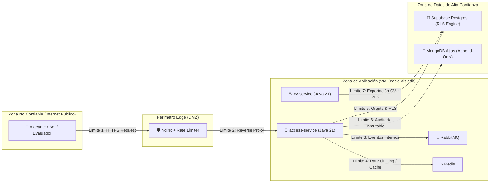

# Modelo de Amenazas STRIDE — Flujo de Acceso 48h — ProyectoHV

> **Fase:** 2 · Diseño  
> **Estado:** Aprobado para diseño técnico  
>
> **Decisión humana**
> - **Qué decidió Harold:** Formalizar un modelo de amenazas STRIDE exhaustivo enfocado en el flujo de acceso privado con TTL de 48 horas; aplicar el principio de que "la interfaz web es solo un visor y la seguridad reside en la base de datos"; incorporar marcas de agua forenses en documentos exportados para mitigar repudio; y blindar las cuotas de capas gratuitas contra abusos DoS.
> - **Qué ejecutó la IA:** Identificación sistemática de vectores de ataque en los 5 pasos del flujo de acceso, matriz de puntuación de riesgo DREAD, diseño de controles criptográficos (tokens opacos con hash SHA-256) y mecanismos de defensa en profundidad.
> - **Riesgo técnico asumido conscientemente:** La verificación estricta de DNS MX bloquea solicitudes de evaluadores cuyos correos corporativos tengan servidores de correo en migración o DNS mal configurados; se asume la exclusión temporal para priorizar la protección anti-spam y anti-bots.
> - **Alternativas descartadas:** Confiar en la expiración de tokens JWT en el navegador (vulnerable a manipulaciones en local storage o reuso de tokens robados); permitir correos genéricos (Gmail, Outlook) en el nivel privado (elimina la capacidad de atribuir descargas y desborda la cuota de envío de correos).

---

## 1. Superficie de Ataque y Límites de Confianza

El flujo de acceso privado de 48 horas conecta actores no autenticados en internet con información profesional profunda y confidencial.



---

## 2. Análisis Sistemático STRIDE

### 2.1. S — Spoofing (Suplantación de Identidad)

| ID | Amenaza Específica | Vector de Ataque | Mitigación Arquitectónica Obligatoria | Control Técnico | Severidad |
|---|---|---|---|---|---|
| **S-01** | Suplantación de evaluador corporativo con dominio inventado | Un atacante ingresa `evaluador@dominio-inexistente-123.com` para provocar rebotes o saturar el sistema. | **Resolución asíncrona de registros DNS MX** previa a la emisión del Magic Link. Si el dominio carece de registros MX activos, la solicitud se rechaza de inmediato. | `DnsMxResolverAdapter` con timeout de 3 s y cache de dominios válidos. | 🔴 Alta |
| **S-02** | Suplantación de correo corporativo real sin acceso al buzón | Un atacante solicita acceso con `ceo@empresa-real.com` para espiar o bloquear a la empresa legítima. | **Principio de prueba de posesión por Magic Link:** El token se envía exclusivamente al buzón destinatario vía SMTP transaccional. Sin control del correo, es imposible reclamar el grant. | Resend SMTP API con TLS forzado y SPF/DKIM/DMARC alineados. | 🔴 Alta |
| **S-03** | Evasión de rate limiting mediante falsificación de cabeceras IP | Un atacante inyecta cabeceras `X-Forwarded-For: 1.2.3.4` para saltarse los límites de solicitud. | **Terminación estricta de IP en Nginx:** La directiva `real_ip_header` solo confía en la conexión TCP entrante del proxy edge (Netlify/Cloudflare), descartando cabeceras arbitrarias del cliente. | Nginx `set_real_ip_from` configurado con rangos oficiales del proxy. | 🟡 Media |

---

### 2.2. T — Tampering (Manipulación de Datos)

| ID | Amenaza Específica | Vector de Ataque | Mitigación Arquitectónica Obligatoria | Control Técnico | Severidad |
|---|---|---|---|---|---|
| **T-01** | Modificación del token en la URL del Magic Link | Un atacante altera bytes del parámetro `?token=...` para intentar colisionar con otro grant activo. | **Tokens de entropía criptográfica completa:** Generación de 32 bytes cryptorandom (256 bits de entropía) en Base64URL. Espacio de búsqueda de $2^{256}$ (fuerza bruta matemáticamente inviable). En DB solo se almacena `token_hash = SHA-256(token)`. | `SecureRandom` de Java 21 + `MessageDigest.getInstance("SHA-256")`. | 🔴 Alta |
| **T-02** | Alteración del TTL o privilegios en cookies/headers | El usuario modifica la fecha de expiración en las cookies del navegador para extender el acceso a 1 año. | **El cliente nunca gobierna el tiempo:** Las cookies solo transportan un identificador opaco de sesión (`session_secret`). La expiración se evalúa exclusivamente en PostgreSQL mediante `expires_at > now()`. | Función `is_active_grant()` en PostgreSQL con `SECURITY DEFINER`. | 🔴 Alta |
| **T-03** | Inyección SQL en parámetros de consulta | Manipulación de campos de búsqueda o filtros para saltarse las restricciones de RLS. | **Consultas 100% parametrizadas:** Prohibida la concatenación de cadenas SQL en microservicios y Edge Functions. Uso estricto de Spring `JdbcClient` con parámetros enlazados (`:param`). | SonarCloud Gate (0 Security Hotspots) y auditoría estricta de código. | 🔴 Alta |

---

### 2.3. R — Repudiation (Repudio)

| ID | Amenaza Específica | Vector de Ataque | Mitigación Arquitectónica Obligatoria | Control Técnico | Severidad |
|---|---|---|---|---|---|
| **R-01** | El evaluador niega haber accedido o descargado el CV confidencial | Un competidor o evaluador filtra el CV privado y afirma que nunca visitó el sitio. | **Auditoría inmutable multivariable + Marca de agua dinámica:** Cada descarga genera un evento en MongoDB Atlas con hash de IP, User-Agent, ID de grant y timestamp; el PDF descargado se estampa dinámicamente con una marca de agua visible e invisible con los datos del evaluador. | Apache PDFBox / AWS Lambda Stamping con marca de agua en diagonal y metadatos XMP. | 🔴 Alta |
| **R-02** | Negación de consentimiento para tratamiento de datos personales (Habeas Data) | Un usuario afirma que el sistema almacenó su correo corporativo sin su autorización. | **Consentimiento explícito y trazable (Ley 1581 / RF-14):** La solicitud requiere un checkbox obligatorio de consentimiento; el registro en `access.requests` guarda `has_consent = TRUE` y el timestamp exacto de aceptación. | Validación Bean Validation `@AssertTrue` en `RequestAccessDto`. | 🟡 Media |

---

### 2.4. I — Information Disclosure (Fuga de Información)

| ID | Amenaza Específica | Vector de Ataque | Mitigación Arquitectónica Obligatoria | Control Técnico | Severidad |
|---|---|---|---|---|---|
| **I-01** | Fuga de nombres de clientes corporativos de empleadores previos | Un atacante inspecciona el código HTML, llamadas de red o metadatos para descubrir clientes reales del empleador actual o anteriores. | **Cumplimiento estricto de Regla #0:** Prohibición absoluta de nombrar clientes corporativos incluso en el nivel privado. Toda entidad corporativa se describe por sector ("Sector Financiero", "Empresa de Manufactura"). | Guardrail determinista en CI (`--require-lists`) bloquea el build si detecta coincidencias. | 🔴 Crítica |
| **I-02** | Acceso a expectativas salariales y datos privados sin grant válido | Un visitante público consulta directamente endpoints de compensación o perfiles detallados. | **Aislamiento a nivel de motor de base de datos (PostgreSQL RLS):** Las tablas `content.compensation_details` y `content.private_adrs` deniegan lectura a roles anónimos y validan `is_active_grant(grant_id)` en tiempo de ejecución. | Políticas RLS de PostgreSQL activas sin posibilidad de bypass por API. | 🔴 Crítica |
| **I-03** | Fuga de secretos, claves de DB o tokens en el repositorio público | Exposición accidental de credenciales en commits de GitHub. | **Defensa de Cuádruple Barrera:** Hooks PreToolUse bloquean comandos con secretos en local; Capa 4 de CI (`guardrails.yml`) valida patrones; uso de OIDC federado para AWS sin claves estáticas. | Motor unificado `hv-rules.mjs` + GitHub Secret Scanning. | 🔴 Crítica |

---

### 2.5. D — Denial of Service (Denegación de Servicio)

| ID | Amenaza Específica | Vector de Ataque | Mitigación Arquitectónica Obligatoria | Control Técnico | Severidad |
|---|---|---|---|---|---|
| **D-01** | Inundación de solicitudes de Magic Link para agotar la cuota de Resend | Un atacante envía 5,000 solicitudes de correo para consumir el límite mensual gratuito (3,000 correos/mes). | **Rate limiting multinivel en Redis:** Máximo 5 solicitudes por hora por dirección IP; máximo 3 solicitudes por día por dirección de correo electrónico; cooldown de 24 horas para extensiones. | Contadores atómicos con TTL en Redis (`INCR` + `EXPIRE`). | 🔴 Alta |
| **D-02** | Sobrecarga de CPU en la VM ARM mediante consultas vectoriales masivas | Un bot ejecuta búsquedas semánticas concurrentes con embeddings de texto largo. | **Límite de recursos en contenedor + Cache de búsqueda:** Contenedor `search-service` acotado a 0.40 OCPU; cache Redis de consultas previas (TTL 30 min); índice HNSW optimizado en Postgres. | Quotas Docker Compose (`cpus: "0.40"`) + Redis cache. | 🟡 Media |
| **D-03** | Solicitud continua de extensiones de 48h para acceso perpetuo | Un evaluador solicita extensiones en bucle cada 47 horas para nunca perder el acceso. | **Regla de extensión única:** La columna `extension_count` en `access.grants` tiene un check constraint estricto `extension_count <= 1`. Solo se permite una única extensión de 48 h adicionales (máximo total 96 h). | Restricción CHECK en base de datos: `CHECK (extension_count <= 1)`. | 🟡 Media |

---

### 2.6. E — Elevation of Privilege (Escalada de Privilegios)

| ID | Amenaza Específica | Vector de Ataque | Mitigación Arquitectónica Obligatoria | Control Técnico | Severidad |
|---|---|---|---|---|---|
| **E-01** | Uso de grant temporal expirado para invocar APIs privadas | Un atacante reutiliza un token reclamado hace 5 días para descargar un CV actualizado. | **Evaluación dinámica del tiempo en cada request:** La base de datos calcula `expires_at > now()` en cada consulta RLS. Si el tiempo expiró, PostgreSQL retorna instantáneamente 0 filas (o excepción 401). | Consulta SQL evaluada en motor Postgres, sin estado en memoria de API. | 🔴 Alta |
| **E-02** | Acceso a funciones administrativas o de modificación de contenido | Un evaluador acreditado intenta modificar el perfil o crear nuevos registros. | **Separación estricta de roles:** Los microservicios solo operan con un usuario de base de datos de mínimos privilegios (`service_role` restringido o usuario específico de aplicación). Las migraciones y mutaciones solo corren desde el pipeline de CI. | Rol PostgreSQL `proyectohv_app` con permisos exclusivos `SELECT` e `INSERT` controlado. | 🔴 Alta |

---

## 3. Matriz de Riesgo DREAD

Para priorizar las defensas implementadas en la arquitectura, se evaluaron los riesgos según el modelo DREAD (Damage, Reproducibility, Exploitability, Affected users, Discoverability):

| Amenaza | D | R | E | A | D | Total (1-10) | Nivel de Riesgo | Estado de Mitigación |
|---|---|---|---|---|---|---|---|---|
| **I-01** (Fuga clientes corporativos) | 10 | 8 | 5 | 10 | 7 | **8.0** | 🔴 Crítico | ✅ Mitigado (Regla #0 + CI Guard) |
| **I-02** (Fuga de datos salariales) | 8 | 9 | 6 | 8 | 8 | **7.8** | 🔴 Alto | ✅ Mitigado (Postgres RLS) |
| **T-02** (Manipulación de TTL en cliente) | 9 | 8 | 7 | 8 | 7 | **7.8** | 🔴 Alto | ✅ Mitigado (RLS `expires_at > now()`) |
| **D-01** (Agotamiento cuota correos) | 7 | 10 | 9 | 10 | 9 | **9.0** | 🔴 Crítico | ✅ Mitigado (Rate Limit Redis) |
| **S-01** (Suplantación con dominios falsos) | 6 | 10 | 8 | 6 | 8 | **7.6** | 🔴 Alto | ✅ Mitigado (DNS MX Resolver) |
| **R-01** (Repudio de descarga de CV) | 7 | 6 | 6 | 6 | 6 | **6.2** | 🟡 Medio | ✅ Mitigado (Watermark + Mongo Audit) |

---

## 4. Arquitectura del Token Criptográfico Seguro

Para garantizar que los tokens sean totalmente inviolables:

```
[32 Bytes Cryptorandom] ──> [Base64URL Encoding] ──> [Raw Token (43 caracteres)]
         │                                                      │
         │ (Para persistencia en DB)                            │ (Para Magic Link en email)
         ▼                                                      ▼
  [SHA-256 Hashing]                               https://proyectohv.dev/verify?token=...
         │                                                      │
         ▼                                                      ▼
[token_hash (64 caracteres hex)]                  [Evaluador hace clic en enlace]
         │                                                      │
         ▼                                                      ▼
[Almacenado en access.grants]                     [access-service calcula SHA-256(token)]
                                                                │
                                                                ▼
                                                [Búsqueda indexada: token_hash = input_hash]
```

### Propiedades de Seguridad:
1. **Un Solo Uso (Single-Use):** Una vez que el enlace se verifica por primera vez, `claimed_at` se registra y el token se invalida para reclamaciones subsecuentes, generando una cookie de sesión cifrada.
2. **Resistencia a Brechas de Persistencia:** Si un atacante llegara a volcar la tabla `access.grants` mediante una brecha de base de datos, solo obtendría hashes unidireccionales SHA-256. No puede reconstruir los tokens raw originales para autenticarse.
