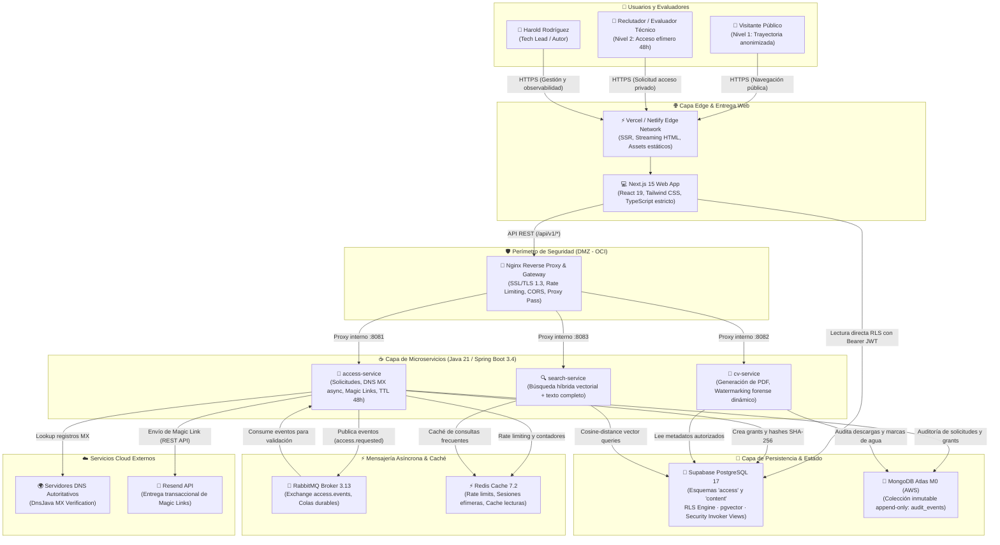
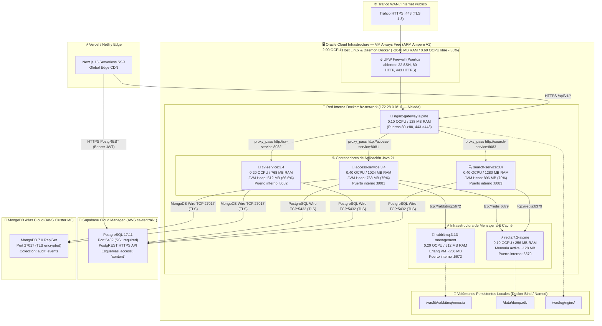
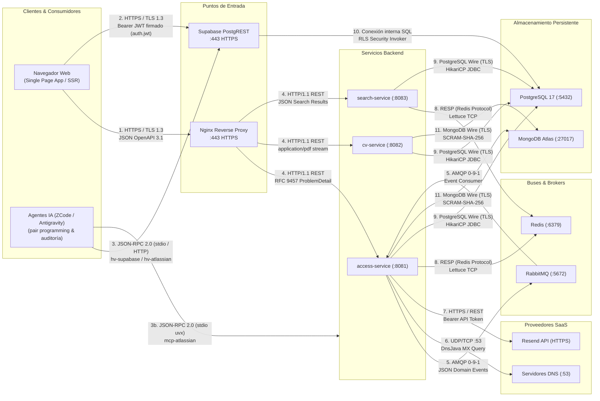
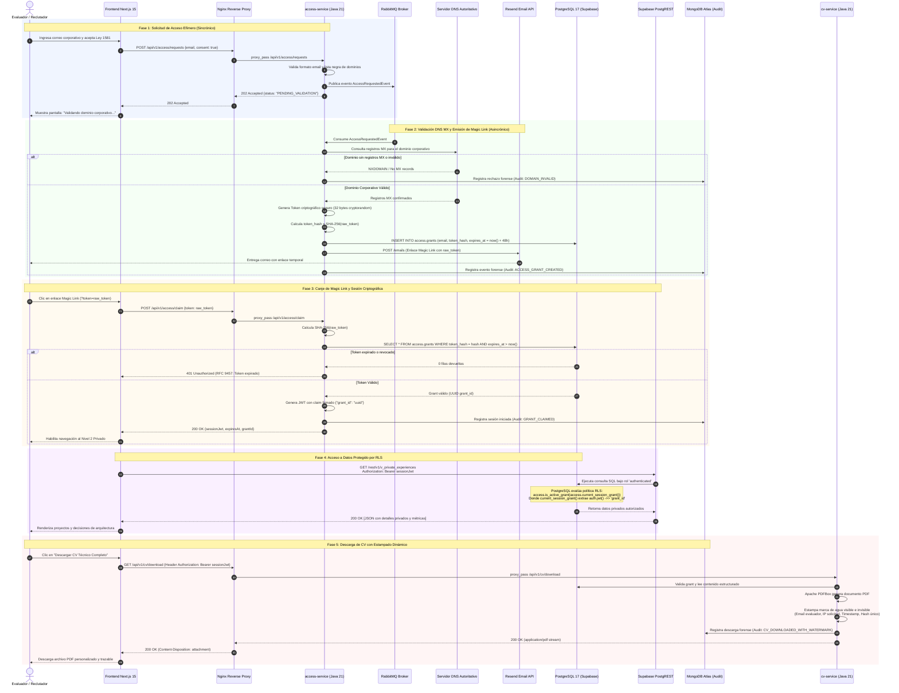

# 📐 Diagramas de Arquitectura del Sistema — ProyectoHV

> **Fase 2: Arquitectura y Diseño**  
> **Fuente de verdad:** `docs/02-diseno/`  
> **Alineación:** C4 Model, STRIDE Threat Model, Clean/Hexagonal Architecture y Regla #0.  
> **Autor & Decisión Humana:** Harold Augusto Rodríguez Martínez (Líder Técnico / Tech Lead)  
> **Fecha:** 2026-10-02

---

## 📑 Índice de Vistas Arquitectónicas

1. [🏛️ 1. Diagrama de Arquitectura de Alto Nivel (HLD)](#1-diagrama-de-arquitectura-de-alto-nivel-hld)
2. [🧩 2. Diagrama Lógico de Arquitectura (Hexagonal & Bounded Contexts)](#2-diagrama-lógico-de-arquitectura-hexagonal--bounded-contexts)
3. [🖥️ 3. Diagrama Físico de Arquitectura y Despliegue (Infraestructura OCI ARM)](#3-diagrama-físico-de-arquitectura-y-despliegue-infraestructura-oci-arm)
4. [🔌 4. Diagrama de Arquitectura de Integración (Protocolos, Interfaces y Seguridad)](#4-diagrama-de-arquitectura-de-integración-protocolos-interfaces-y-seguridad)
5. [🔄 5. Diagrama de Flujo de Arquitectura (Flujo E2E de Acceso Efímero 48h y RLS)](#5-diagrama-de-flujo-de-arquitectura-flujo-e2e-de-acceso-efímero-48h-y-rls)

---

## 1. Diagrama de Arquitectura de Alto Nivel (HLD)

El diagrama de alto nivel sintetiza los actores del sistema, la frontera de entrada (Edge y CDN), el perímetro de seguridad en la DMZ, los microservicios core en Java 21, la infraestructura de soporte y la persistencia políglota distribuida.

---

## 2. Diagrama Lógico de Arquitectura (Hexagonal & Bounded Contexts)

Ilustra la separación de responsabilidades lógicas basada en **Arquitectura Hexagonal (Puertos y Adaptadores)** y **Domain-Driven Design (DDD)** para aislar la lógica de negocio pura de frameworks y bases de datos.

```mermaid
classDiagram
    %% Bounded Context: Access Management
    namespace Access_Domain_Core {
        class AccessRequest {
            -RequestId id
            -Email corporateEmail
            -ValidationStatus status
            -Instant requestedAt
            +markDnsValid()
            +markDnsInvalid(String reason)
        }
        class AccessGrant {
            -GrantId id
            -RequestId requestId
            -Email corporateEmail
            -TokenHash tokenHash
            -Instant expiresAt
            -int extensionCount
            -boolean isRevoked
            +boolean isExpired()
            +boolean canBeExtended()
            +extend48Hours()
            +revoke(String reason)
        }
        class GrantExtension {
            -ExtensionId id
            -GrantId grantId
            -int extensionNumber
            -ExtensionStatus status
            -Instant newExpiresAt
        }
        class CorporateEmailPolicy {
            +boolean isCorporateDomain(String domain)
            +boolean isBlockedProvider(String domain)
        }
    }

    namespace Access_Inbound_Ports {
        class RequestAccessUseCase {
            <<interface>>
            +execute(RequestAccessCommand) RequestAccessResult
        }
        class ValidateDnsMxUseCase {
            <<interface>>
            +execute(ValidateDnsCommand) ValidationResult
        }
        class ClaimMagicLinkUseCase {
            <<interface>>
            +execute(ClaimTokenCommand) SessionTokenResult
        }
        class ExtendAccessUseCase {
            <<interface>>
            +execute(ExtendAccessCommand) ExtensionResult
        }
    }

    namespace Access_Outbound_Ports {
        class AccessGrantRepositoryPort {
            <<interface>>
            +saveGrant(AccessGrant grant)
            +findActiveByHash(TokenHash hash) Optional
            +updateGrant(AccessGrant grant)
        }
        class DnsResolverPort {
            <<interface>>
            +hasMxRecords(String domain) boolean
        }
        class NotificationPort {
            <<interface>>
            +sendMagicLink(Email to, String rawToken, Instant expiresAt)
        }
        class AuditEventPort {
            <<interface>>
            +recordSecurityEvent(AuditEvent event)
        }
        class RateLimiterPort {
            <<interface>>
            +isAllowed(String key, int maxRequests, Duration window) boolean
        }
    }

    namespace Access_Adapters {
        class AccessRestController {
            +requestAccess(RequestAccessDTO) ResponseEntity
            +claimToken(String rawToken) ResponseEntity
            +extendAccess(String rawToken) ResponseEntity
        }
        class AccessEventListener {
            +handleAccessRequested(AccessRequestedEvent)
        }
        class PostgresGrantAdapter {
            -JdbcClient jdbcClient
        }
        class DnsJavaAdapter {
            -Lookup lookup
        }
        class ResendMailAdapter {
            -RestClient restClient
        }
        class MongoAuditAdapter {
            -MongoTemplate mongoTemplate
        }
        class RedisRateLimitAdapter {
            -RedisTemplate redisTemplate
        }
    }

    %% Conexiones Hexagonales
    AccessRestController ..|> RequestAccessUseCase : Invoca
    AccessRestController ..|> ClaimMagicLinkUseCase : Invoca
    AccessRestController ..|> ExtendAccessUseCase : Invoca
    AccessEventListener ..|> ValidateDnsMxUseCase : Invoca

    RequestAccessUseCase ..> AccessRequest : Crea
    RequestAccessUseCase ..> CorporateEmailPolicy : Aplica
    RequestAccessUseCase ..> RateLimiterPort : Consulta
    ValidateDnsMxUseCase ..> DnsResolverPort : Consulta
    ValidateDnsMxUseCase ..> AccessGrant : Emite
    ValidateDnsMxUseCase ..> NotificationPort : Notifica
    ValidateDnsMxUseCase ..> AccessGrantRepositoryPort : Persiste
    ValidateDnsMxUseCase ..> AuditEventPort : Audita

    PostgresGrantAdapter ..|> AccessGrantRepositoryPort : Implementa
    DnsJavaAdapter ..|> DnsResolverPort : Implementa
    ResendMailAdapter ..|> NotificationPort : Implementa
    MongoAuditAdapter ..|> AuditEventPort : Implementa
    RedisRateLimitAdapter ..|> RateLimiterPort : Implementa
```

---

## 3. Diagrama Físico de Arquitectura y Despliegue (Infraestructura OCI ARM)

Detalla el mapeo de procesos, cuotas de cómputo y aislamiento de red en la infraestructura Always Free de **Oracle Cloud Infrastructure (OCI)** y nubes administradas.

### Conciliación de Recursos de Cómputo (VM Oracle ARM)

| Proceso / Contenedor | CPU Quota (Ceiling) | Límite RAM Docker | Heap JVM (`MaxRAMPercentage`) | Propósito |
|---|---|---|---|---|
| **nginx-gateway** | 0.10 OCPU | 128 MB | N/A (C nativo) | Reverse Proxy, SSL, Rate Limit |
| **access-service** | 0.40 OCPU | 1024 MB | 768 MB (75.0%) | Dominio de accesos y tokens |
| **cv-service** | 0.20 OCPU | 768 MB | 512 MB (66.6%) | Generación de PDFs y marcas de agua |
| **search-service** | 0.40 OCPU | 1280 MB | 896 MB (70.0%) | Búsqueda semántica vectorial |
| **rabbitmq-broker** | 0.20 OCPU | 512 MB | ~256 MB (Erlang) | Event bus asíncrono durable |
| **redis-cache** | 0.10 OCPU | 256 MB | ~128 MB (C nativo) | Caché en memoria y rate limits |
| **Subtotal Contenedores** | **1.40 OCPU** | **3968 MB (~3.88 GB)** | **2176 MB (~2.13 GB)** | Carga máxima acotada |
| **Host Linux + Docker Daemon** | 0.60 OCPU (**30%**) | ~2048 MB (~2.00 GB) | N/A | Sistema base y red bridge |
| **Capacidad Total VM** | **2.00 OCPU (100%)** | **12288 MB (12.00 GB)**| **6272 MB (~6.12 GB libre, ~51%)** | Margen de estabilidad sin swapping |

---

## 4. Diagrama de Arquitectura de Integración (Protocolos, Interfaces y Seguridad)

Presenta la matriz de comunicación de sistemas, interfaces de programación, formatos de serialización, estándares de error y mecanismos de autenticación y cifrado.

### Matriz de Integración de Protocolos y Seguridad

| Enlace / Interfaz | Protocolo | Formato / Payload | Autenticación / Cifrado | Estándar de Contrato |
|---|---|---|---|---|
| **Browser $\rightarrow$ Nginx** | HTTPS (TLS 1.3) | JSON / Form-Data | TLS Certbot Let's Encrypt | OpenAPI 3.1 |
| **Browser $\rightarrow$ PostgREST** | HTTPS (TLS 1.3) | JSON | `Authorization: Bearer <sessionJwt>` | OpenAPI / PostgREST spec |
| **Nginx $\rightarrow$ Microservicios** | HTTP/1.1 (Bridge interno) | JSON | Aislamiento de red Docker `hv-network` | RFC 9457 `ProblemDetail` |
| **Access $\rightarrow$ RabbitMQ** | AMQP 0-9-1 | JSON UTF-8 | Username / Password en variables Docker | `AccessRequestedEvent.json` |
| **Access $\rightarrow$ DNS** | DNS over UDP/TCP :53 | DNS Wire Format | Consultas recursivas a resolver autoritativo | RFC 1035 (MX Records) |
| **Access $\rightarrow$ Resend** | HTTPS (TLS 1.3) | JSON payload | `Authorization: Bearer <resend_key>` | Resend REST API v1 |
| **Backend $\rightarrow$ Redis** | RESP | Strings / Hashes | Contraseña Redis (`requirepass`) | Claves con namespaces (`ratelimit:*`) |
| **Backend $\rightarrow$ PostgreSQL** | PG Wire Protocol | Binary / SQL | SSL Required (`sslmode=require`) + HikariCP | Esquemas DDL `access` y `content` |
| **PostgREST $\rightarrow$ PostgreSQL** | PG Engine Internal | SQL Queries | RLS policies (`auth.jwt() ->> 'grant_id'`) | DDL Security Invoker Views |
| **Backend $\rightarrow$ MongoDB** | MongoDB Wire Protocol | BSON | TLS 1.3 + SCRAM-SHA-256 | Schema inmutable `audit_events` |

---

## 5. Diagrama de Flujo de Arquitectura (Flujo E2E de Acceso Efímero 48h y RLS)

Detalla el ciclo completo de interacción temporal, desde la solicitud de acceso por parte del evaluador técnico hasta la lectura protegida por políticas RLS y la entrega forense de documentos.

---

## 6. Registro de Decisión Humana (Gobernanza del Proyecto)

* **Decisión Humana:** Aprobación de la arquitectura quíntuple (Alto Nivel, Lógica, Física, Integración y Flujo) para ProyectoHV.
* **Justificación Técnica:** La descomposición en cinco vistas complementarias garantiza que el sistema sea comprensible y auditable desde diferentes perspectivas de ingeniería:
  1. *HLD:* Comprensión del sistema para directores y evaluadores.
  2. *Lógica:* Garantía de desacoplamiento de frameworks mediante Clean/Hexagonal Architecture.
  3. *Física:* Certificación de viabilidad en el hardware ARM Always Free con 51% de holgura de memoria.
  4. *Integración:* Especificación estricta de protocolos, puertos y serialización sin puntos ciegos.
  5. *Flujo:* Verificación visual del modelo STRIDE y el TTL de 48 horas evaluado en base de datos.
* **Autor & Firma:** Harold Augusto Rodríguez Martínez (Líder Técnico)  
* **Fecha de Formalización:** 2026-10-02
