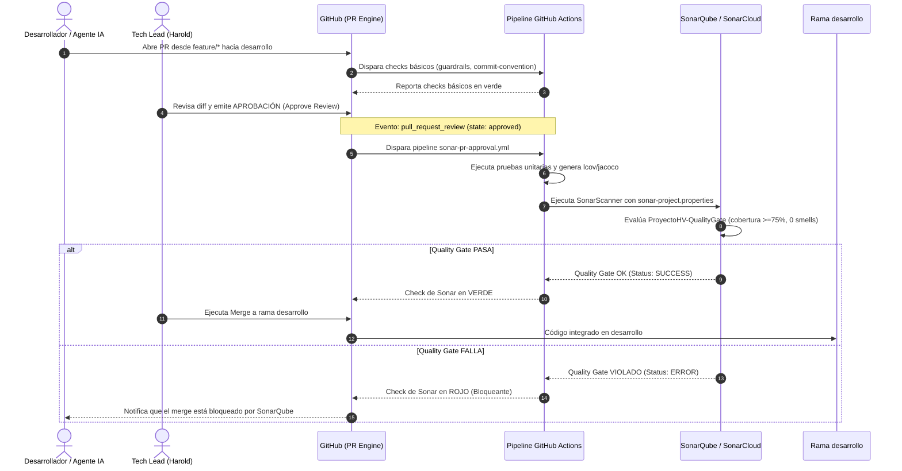
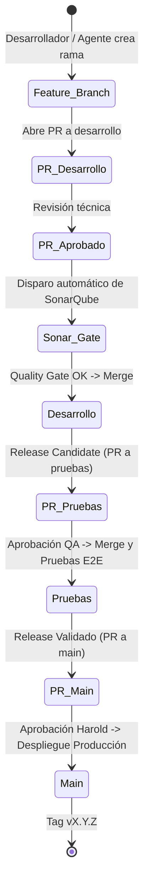

# 🌿 Estrategia de Ramas, Colaboración Multi-Agente y Quality Gate con SonarQube

> **Fase:** 2 · Diseño y Arquitectura  
> **Estado:** Aprobado (Diseño Arquitectónico) — En Fase de Activación Remota  
> **Relacionado:** [`ADR-007`](adr/ADR-007-estrategia-ramas-aprobacion-sonar.md) · [`03-estrategia-devops.md`](../01-planificacion/03-estrategia-devops.md) · [`pipelines/README.md`](../../pipelines/README.md)
>
> **Decisión humana**
> - **Qué decidió Harold:** Establecer un modelo formal de 3 ramas protegidas (`desarrollo`, `pruebas`, `main`) con bloqueo absoluto de push directo, exigir aprobación obligatoria de Pull Requests en los tres niveles para simular un entorno corporativo real con múltiples desarrolladores y agentes de IA concurrentes, y disparar automáticamente el análisis de SonarQube con compuerta de calidad (Quality Gate) al momento exacto en que un PR hacia `desarrollo` recibe aprobación.
> - **Qué ejecutó la IA:** Especificación técnica del ciclo de vida de ramas, matriz de roles y responsabilidades para agentes de IA (`hv-*`) y humanos, arquitectura del pipeline en GitHub Actions con evento `pull_request_review`, definición de compuertas bloqueantes y diagramas de flujo y secuencia.
> - **Riesgo técnico asumido conscientemente:** Mayor fricción operativa y tiempo de integración por la obligatoriedad de aprobaciones y revisiones en los 3 niveles, mitigado mediante la automatización de checks deterministas (guardrails, pruebas y SonarQube) y paralelización de agentes en ramas de trabajo efímeras.
> - **Alternativas descartadas:** Trunk-based development directo en `main` (descartado por no permitir etapas de homologación formal en staging ni simular un equipo multidisciplinario); GitFlow clásico con ramas intermedias de release complejas (descartado por sobrecarga de sincronización para un portafolio de alta agilidad).

---

## 1. Propósito y Filosofía

ProyectoHV no es únicamente un portafolio estático: es un **laboratorio y exhibit vivo de ingeniería de software moderna**. Para demostrar maestría técnica y liderazgo de equipos de alto rendimiento, el repositorio simula y ejecuta las dinámicas de un equipo de ingeniería distribuido donde interactúan simultáneamente:

1. **Desarrolladores humanos y Tech Lead (Harold)**: Aportan decisiones de negocio, diseño arquitectónico, revisión de código de pares y aprobación final de entregas.
2. **Subagentes de IA especializados (`hv-*`)**: Asumen roles específicos (Frontend, Backend Spring Boot, Serverless, Base de Datos, Compliance), operando de forma autónoma en sus respectivos contextos pero bajo estrictas reglas de integración.

Para gobernar esta concurrencia sin riesgo de colisiones, regresiones o filtraciones de confidencialidad, se establece un modelo de **Tres Ramas Base Protegidas** gobernado por **Pull Requests auditados y aprobados**.

---

## 2. Topología de las 3 Ramas Base

El repositorio mantiene permanentemente tres ramas de larga duración, cada una con un nivel de estabilidad, propósito y entorno asociado:

```
feature/* ──┐
bugfix/*  ──┴─► [desarrollo] ────► [pruebas] ────► [main] (Producción)
                      │                │               │
                 SonarQube        Homologación      Netlify /
               Quality Gate       QA & E2E Tests     Oracle VM
```

| Rama | Entorno Asociado | Propósito Técnico | Política de Entrada | Aprobadores Requeridos |
|---|---|---|---|---|
| **`desarrollo`** | Desarrollo / Integración Continua | Integración activa y diaria de cambios, features y correcciones desarrolladas por humanos y agentes. | **Push directo bloqueado.** Exclusivamente vía PR desde ramas `feature/*` o `bugfix/*`. | **Al menos 1 aprobación**: Tech Lead (Harold) o agente revisor (`hv-compliance`). |
| **`pruebas`** | Staging / QA / Homologación | Estabilización previa a producción, pruebas de regresión, integración entre microservicios, suites E2E (Playwright) y validación de seguridad. | **Push directo bloqueado.** Exclusivamente vía PR desde `desarrollo`. | **Al menos 1 aprobación formal**: Tech Lead (Harold) tras validar suites de prueba completas. |
| **`main`** | Producción | Código final, release verificado, versión inmutable y etiquetada (`vX.Y.Z`). Código servido en vivo a reclutadores y visitantes. | **Push directo bloqueado.** Exclusivamente vía PR desde `pruebas` (o `hotfix/*`). | **Aprobación mandatoria y exclusiva**: Tech Lead (Harold). |

### 2.1. Estado de Operatividad y Activación Remota
> ⚠️ **Distinción entre Diseño e Implementación:**
> - **En local (actual):** Los primeros 22 commits se integraron directamente en `main` durante el scaffolding inicial (Fase 1 y Fase 2).
> - **En remoto (GitHub):** El bloqueo formal de push directo y la obligatoriedad de aprobaciones se activan mediante reglas de protección de rama (*Settings → Branches / Rulesets*) al sincronizar con el repositorio remoto.
> - **Entrada en vigor:** El flujo formal de 3 ramas se activa a partir del primer incremento funcional (Slice 1.3), canalizando todo cambio a través de PRs hacia `desarrollo`.

---

## 3. Ramas Efímeras de Trabajo

Ningún cambio se codifica directamente sobre las tres ramas base. Todo desarrollo o corrección se realiza en ramas efímeras de vida corta:

| Prefijo de Rama | Origen | Destino | Uso | Ejemplo |
|---|---|---|---|---|
| `feature/<responsable>/<tarea>` | `desarrollo` | `desarrollo` | Nuevas funcionalidades, endpoints, pantallas o componentes. | `feature/frontend/slice-1-hero`<br>`feature/backend/dns-mx-verification` |
| `bugfix/<responsable>/<tarea>` | `desarrollo` | `desarrollo` | Corrección de fallos o hallazgos detectados en pruebas locales o en `desarrollo`. | `bugfix/compliance/fix-lcov-exclusion` |
| `hotfix/<tarea>` | `main` | `main` + `pruebas` + `desarrollo` | Parches urgentes para fallos críticos detectados en producción. | `hotfix/security-token-header` |

> 📌 **Regla de nomenclatura:** El `<responsable>` puede ser una persona o el identificador del agente (`frontend`, `backend`, `db`, `devops`, `ia`).

---

## 4. Colaboración Multi-Agente y Humana

Para simular una célula de ingeniería ágil con múltiples participantes humanos y sintéticos, se aplican las siguientes reglas operativas:

### 4.1. Asignación de Roles Agénticos
- **`hv-orchestrator`**: Descompone las épicas e historias de usuario en tareas manejables y asigna ramas de trabajo.
- **`hv-frontend`**: Trabaja en ramas `feature/frontend/*` sobre el directorio `web/`.
- **`hv-backend-spring`**: Trabaja en ramas `feature/backend/*` sobre `services/`.
- **`hv-database`**: Trabaja en ramas `feature/db/*` sobre `supabase/`.
- **`hv-compliance`**: Subagente auditor (Read-Only). No emite código: analiza diffs de PRs para certificar la Regla #0, confidencialidad, límites de memoria y estilo de commits.
- **Tech Lead Harold**: Diseña la arquitectura, revisa el código, resuelve disputas técnicas y aprueba o rechaza los PRs.

### 4.2. Protocolo de Trabajo Concurrente
1. **Branch Checkout**: El agente o persona obtiene la última versión de `desarrollo`:
   ```bash
   git checkout desarrollo
   git pull origin desarrollo
   git checkout -b feature/<rol>/<descripcion>
   ```
2. **Desarrollo con Guardrails Locales**: Cada commit debe cumplir con Conventional Commits (`commit-convention.mjs`) y respetar la Regla #0 (cero datos de clientes corporativos y cero PII).
3. **Apertura de Pull Request**: Al finalizar la tarea, se abre un PR hacia la rama `desarrollo` documentando:
   - Resumen del cambio y problema resuelto.
   - Pruebas unitarias ejecutadas.
   - `Decisión humana` explícita.
4. **Revisión de Pares**: Otro agente o Harold revisa los cambios mediante comentarios de revisión.

---

## 5. Gatillado Automático de SonarQube en Aprobación de PR

El requisito central de calidad en la integración de `desarrollo` es la **ejecución incondicional del análisis de SonarQube y validación de su Quality Gate al momento de aprobar un Pull Request**.

### 5.1. Mecanismo de Disparo en GitHub Actions
GitHub Actions permite capturar el evento `pull_request_review` cuando un revisor envía su veredicto. El pipeline `.github/workflows/sonar-pr-approval.yml` se activa específicamente bajo la siguiente condición:

```yaml
on:
  pull_request_review:
    types: [submitted]
  pull_request:
    branches: [desarrollo]
    types: [opened, synchronize, reopened]
```

La compuerta evalúa:
- Si el evento es `pull_request_review`, verifica que:
  `github.event.review.state == 'approved'` **Y** `github.event.pull_request.base.ref == 'desarrollo'`
- Si la condición se cumple, se dispara de inmediato el job `sonar-analysis`.

### 5.2. Compuerta de Calidad (Quality Gate de ProyectoHV)
SonarQube analiza el código nuevo del PR y evalúa las siguientes condiciones bloqueantes:

```
┌─────────────────────────────────────────────────────────────┐
│             ProyectoHV Quality Gate — Criterios             │
├───────────────────────────────┬─────────────────────────────┤
│ Cobertura en Código Nuevo     │ ≥ 75.0%                     │
│ Nuevos Code Smells Críticos   │ 0                           │
│ Nuevos Bugs o Vulnerabilidades│ 0                           │
│ Hotspots de Seguridad         │ 100% revisados              │
│ Duplicación de Código         │ < 3.0%                      │
│ Complejidad Ciclomática       │ ≤ 15 por función            │
│ Longitud de Métodos           │ ≤ 40 líneas                 │
│ TypeScript Any                │ 0 instancias                │
└───────────────────────────────┴─────────────────────────────┘
```

Si SonarQube determina que el Quality Gate **falla**, el estado del commit se reporta como fallido (`failure`) en GitHub, **bloqueando el botón de merge hacia `desarrollo`** aunque el PR haya sido aprobado humanamente.

> 💡 **Activación Escalonada por Slices (SDLC Real):**
> - **Slices 1 al 3 (Actual):** La compuerta evalúa y bloquea ante 0 bugs, 0 vulnerabilidades, 0 code smells críticos, duplicación < 3% y TypeScript estricto (0 `any`).
> - **Slice 4 (Fase 4: Pruebas y QA):** Con la construcción formal de la pirámide de pruebas unitarias, de integración y E2E, se activa la condición bloqueante de cobertura en código nuevo ($\ge 75\%$). Esto evita la trampa de bloquear el 100% de los PRs en fases iniciales de scaffolding cuando aún no existe el arnés de pruebas.

---

## 6. Diagrama de Secuencia: Aprobación y Disparo de SonarQube



---

## 7. Promoción Entre Entornos: Desarrollo → Pruebas → Main

La promoción de código a través de las 3 ramas base sigue un flujo formal de progresión:



1. **Integración a `desarrollo`**: Múltiples PRs de agentes y desarrolladores se aprueban, pasan SonarQube y se integran.
2. **Promoción a `pruebas`**: Cuando se completa un incremento funcional (Sprint Goal o Vertical Slice), se abre un PR desde `desarrollo` hacia `pruebas`. Al aprobarse, se despliega el entorno de homologación y se corren pruebas E2E (Playwright) y de rendimiento.
3. **Promoción a `main`**: Con la suite E2E en verde y sin incidencias en staging, se abre un PR desde `pruebas` hacia `main`. Este PR requiere la aprobación y firma exclusiva de Harold. El merge dispara el despliegue automático a producción con verificación de health check y plan de rollback inmediato.

---

## 8. Verificación y Ejecución Local

Para garantizar reproducibilidad local antes de abrir o aprobar PRs:

```bash
# 1. Verificar estado de ramas locales
git branch -a

# 2. Iniciar SonarQube localmente
npm run sonar:up

# 3. Validar estado del servicio Sonar
npm run sonar:status

# 4. Ejecutar el análisis local emulando el Quality Gate de CI
npm run sonar:scan

# 5. Evaluar estado del Quality Gate de SonarQube desde terminal
npm run sonar:gate

# 6. Ejecutar la suite determinista de guardrails y sincronía
npm run verify:context
node .agents/skills/hv-guardrails/scripts/run-guardrails.mjs
```
